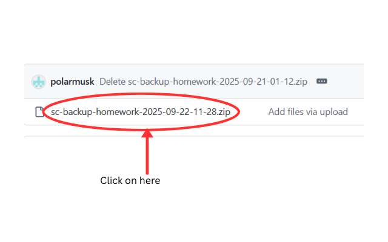
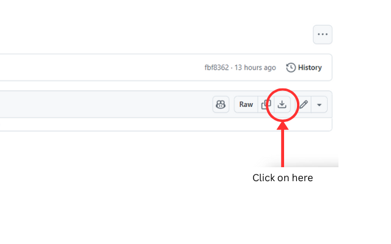

This project is an option extension to Saltcorn Reminders. It functions similarly but is easier to read and add new assignments. 

## Installation

Here's a quick overview of how to install this extension. 

Click on the latest version of the file

Then, click download raw

Thank you using Saltcorn Calendar!

